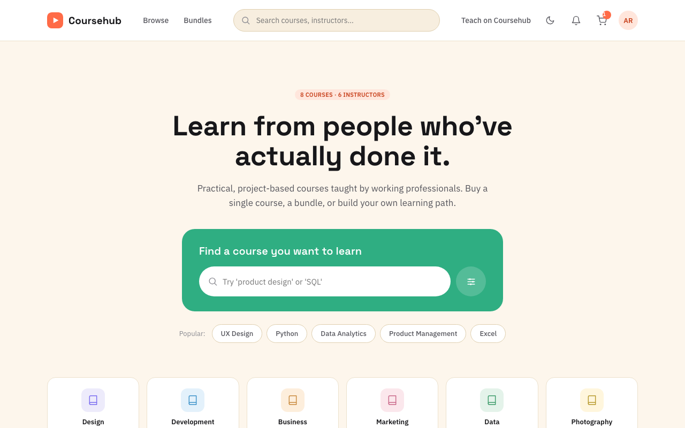
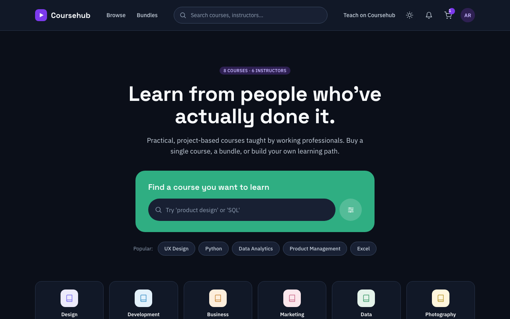
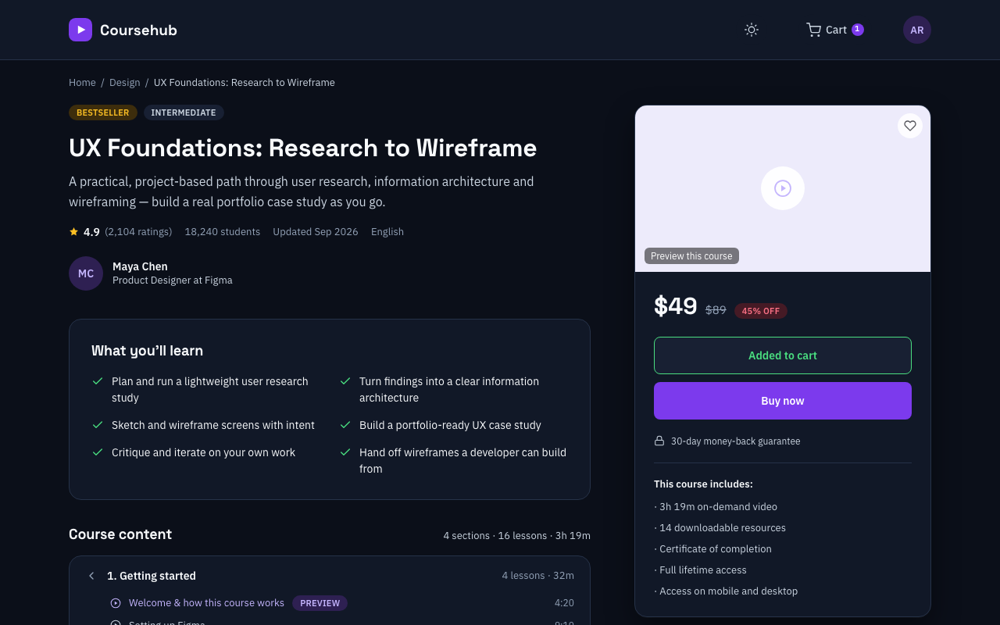
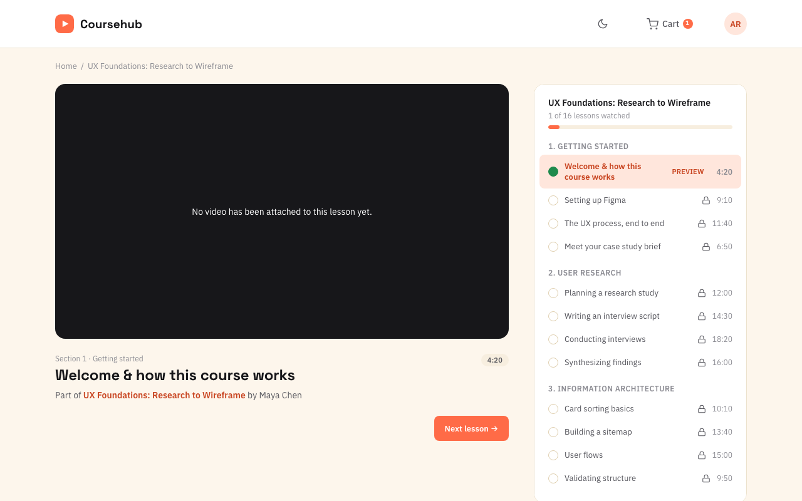
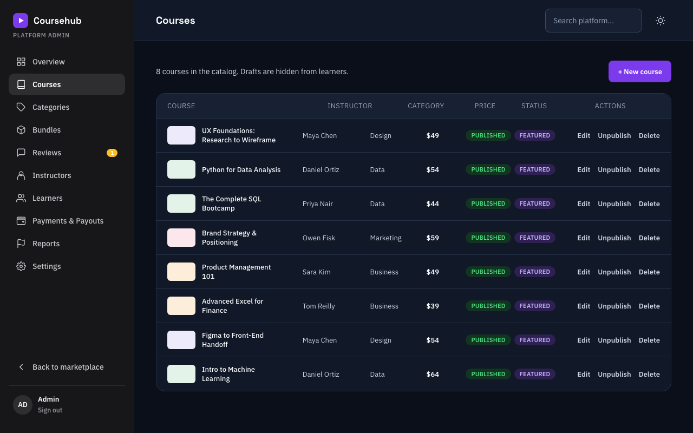
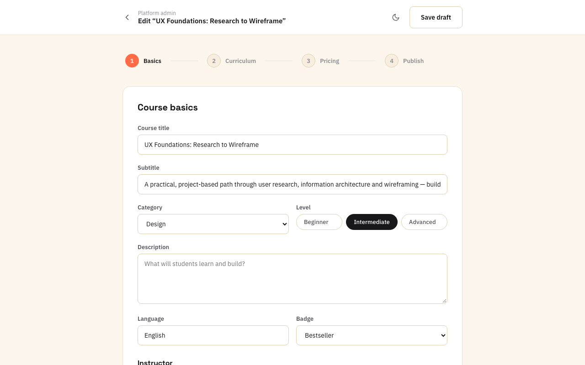

# Coursehub

A course marketplace built from a design handoff: static frontend, Netlify
Functions API, Postgres on Neon. Catalog, bundles, course pages with a lesson
player, moderated reviews, instructor applications, and a token-gated admin
console are real; checkout and user accounts are the next phase.

**Live:** https://cupcourse.netlify.app · **Repo:** https://github.com/Axofox/coursey · **CI:** `.github/workflows/ci.yml`

| | |
|---|---|
|  |  |
|  |  |
|  |  |

Demo (browse → search → course → cart): [docs/demo.webm](docs/demo.webm)

## Status: what's real vs. preview

| Area | Status |
|------|--------|
| Home & catalog, search, category filter, bundles, stats | **Real** — from the database |
| Course page, curriculum, approved reviews, review form | **Real** — reviews are held for admin approval |
| Lesson player (`lesson.html`) | **Real** — YouTube / Vimeo / mp4 links; only *free preview* lessons play until purchases exist |
| Bundle page | **Real** |
| Instructor application (`teach.html`) → admin Instructors tab | **Real** |
| Cart & checkout | **Half** — browser cart with live totals and a validated card form; **nothing is charged** |
| Admin console: Overview, Courses, Categories, Bundles, Reviews, Instructors, Reports | **Real** — signed in with `ADMIN_TOKEN` |
| Admin: Learners, Payments, Settings; learner & seller dashboards | **Preview** — sample data, labelled on the page |
| Wishlist, notifications panel | **Browser-local** / empty state until accounts exist |

Not built yet (needs accounts): sign-up/login/password reset, purchases and
enrolments, certificates, instructor self-service, transactional email.

## Repository layout

```
public/                     the site (no build step)
  index.html, course-detail.html, bundle.html, lesson.html, cart.html, teach.html
  admin-dashboard.html, course-upload.html       admin (token-gated)
  dashboard.html, seller-dashboard.html          previews
  404.html, design/                              error page, style guide + mobile refs
  assets/
    styles.css        design system from the handoff + dark-mode tokens
    site.css          responsive rules and components the handoff lacked
    script.js         handoff interaction layer (theme, tabs, pills, stepper, cart maths)
    theme-boot.js     applies the saved theme before first paint (no inline scripts — see CSP)
    api.js            API client, cart, wishlist, toast, validation, render helpers (window.Coursehub)
    <page>.js         one script per page
netlify/functions/api.mjs   JSON API (Functions v2) — createHandler({ query }) for tests
netlify/lib/db.mjs          pg pool; no DDL at request time
netlify/lib/migrate.mjs     migration runner (also used by tests)
netlify/lib/seed.mjs        starter content matching the design
migrations/NNN-*.sql        versioned schema changes, applied at deploy
scripts/migrate.mjs         `npm run migrate` — the Netlify build command
scripts/mock-server.mjs     `npm run mock` — frontend against an in-memory API
scripts/screenshots.mjs     regenerates docs/screenshots and docs/demo.webm
test/                       unit tests (no DB) · test/integration (real Postgres)
e2e/                        Playwright specs against the mock server
docs/                       ARCHITECTURE.md · OPERATIONS.md · QA.md
```

More detail: [docs/ARCHITECTURE.md](docs/ARCHITECTURE.md) (data model, request flows,
security), [docs/OPERATIONS.md](docs/OPERATIONS.md) (setup, deploy, migrations,
rollback, backup/restore), [docs/QA.md](docs/QA.md) (test strategy, risk matrix, report).

## Quick start

```bash
npm ci
npm test                 # 47 unit tests, no database
npm run test:integration # migrations + API on a throwaway embedded Postgres
npm run test:e2e         # 30 Playwright tests (npx playwright install chromium once)
npm run mock             # http://localhost:8765 — frontend on an in-memory API, admin token "testtoken"
```

To run against a real database locally, put `DATABASE_URL` and `ADMIN_TOKEN` in a
gitignored `.env` and use `npx netlify dev` (see OPERATIONS.md).

## Deploy

Push to `main` → Netlify builds: `npm run migrate` applies pending migrations,
then the site and functions go live. Pull requests get a Netlify deploy preview
and must pass CI (unit, integration, e2e, dependency + secret scan).

## Environment variables

| Name | Where | Purpose |
|------|-------|---------|
| `DATABASE_URL` | Netlify + `.env` | Postgres connection string (Neon, pooled) |
| `ADMIN_TOKEN` | Netlify + `.env` | Required for every write endpoint and the admin UI |
